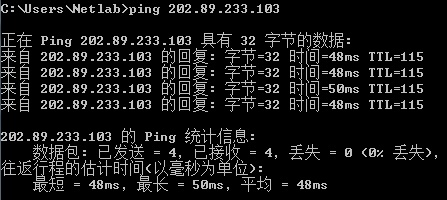

## 计算机网络课程实验报告

> 实验 2 - 数据帧与 IP 包分析
>
> 实验时间: 20th Oct, 2016
>


#### 1) 实验内容与目的

本次实验将在 Windows 环境与 Linux 环境下使用相关网络工具进行数据帧与 IP 包的分析，具体由以下几部分实验组成：

​	(1) 通过在 Windows 环境下使用 Wireshark 捕获并分析一系列数据帧与报文，掌握以太网 MAC 帧与 IP 数据报的构成，了解其各字段含义，初步了解网络流量捕获与分析的有关方法，并掌握 ARP/ICMP 协议的请求/响应机理；

​	(2) 在 CentOS(VM) 环境下使用 sendip 工具构造、封装简单的 IP 数据报，并在 Windows 下使用 Wireshark 进行捕获分析；

​	(3) 编程模拟 IP 数据报首部的封装。


#### 2) 实验过程与分析

##### 实验1. 使用 Wireshark 捕获并分析数据

---

###### 1.1) 记录和解释一个 MAC 帧

​	在启动 Wireshark 时需要指定进行监听的网络接口，实验室硬件环境只有一个网络接口，因此我们在这个接口上进行捕获即可。

 

> ***Fig 1.1*** Setting up Wireshark capture interface

​	在 Wireshark 开始监听网络流量后，我们可以发起一个网络活动来捕获对应的 MAC 帧。

​	如图 1.2 所示，这里我们发起了一个 ping 请求。

 

> ***Fig 1.2*** Pinging IPv4 address *202.89.233.103*

​	因为在一台主机上通常会有很多不同的网络活动在同时进行，因而 Wireshark 可能捕获到大量与我们发起的网络活动无关的流量包。我们可以使用过滤器来过滤出我们所关注的信息，在这里我们可以通过目标 IP 地址实现过滤：`ip.dst == 202.89.233.103`，可以得到下面的帧信息：


> ***Fig 1.3*** Corresponding frame of the Ping action (showing MAC frame header section)

​	数据链路层把网络层交付的 IP 数据报加上帧首部、帧尾部与定界符等构成 MAC 帧后发送到数据链路上，图 1.3 中蓝色高亮部分便是 MAC 帧的首部部分，之后才是 IP 数据报的正式内容。

​	可以观察到该 MAC 帧首部共有 14 个字节，其详细组成如下：

1. Destination: 00:10:18:02:12:da 

   代表接收数据帧的目标节点 MAC 地址，长度为 6 个字节 (48 位)。

2. Source: 48:02:2a:f8:9c:37

   代表发送数据帧的源节点 MAC 地址，即本机 MAC 地址，长度为 6 个字节。

3. Type: IP (0x0800)

   标识出以太网帧所携带的上层数据类型，0x0800 表示上层为 IP 协议。本部分长度为 2 个字节。

   MAC 帧尾部为 4 字节长的 FCS 校验和，在 Wireshark 中未予以显示。

 

> ***Fig 1.4*** Local network configurations

​	通过 `ipconfig /all`  命令可以看到该接口的物理地址与 Wireshark 捕获到的 MAC 帧中的对应字段一致。

* **问题：为什么以太网中 MAC 帧数据字段最小长度为 46 字节？**
  * 以太网 MAC 帧受 “碰撞检测” 限制，规定了 MAC 帧最小长度为 64 字节，而MAC 帧首部含有 14 字节，尾部含有 4 字节，故中间的数据字段最小长度为 $64-14-4=46\ (bytes)$ .


---

###### 1.2) 记录和解释一个 IP 数据报

​	采取同 1.1 中类似的方法，对 *202.89.233.103* 发起 Ping 请求，使用 Wireshark 过滤截获的 IP 数据报。


> ***Fig 1.5*** Header section of IP packet

图 1.5 中蓝色高亮部分即为截获的 IP 数据报首部，可以观察到 IP 数据报首部共有 20 个字节，其详细组成如下：

1. Version: 4

   标注所使用的 IP 协议的版本，一般为 IPv4 或 IPv6，长度为 4 位。4 说明使用的 IP 版本为 IPv4.

2.    Header Length: 20 bytes

      标明 IP 数据报首部的长度，长度为 4 位。这里其数据值为 5，其单位为 32 位字，故表示数据报首部长为 $5*32\ bit = 20\ bytes$.


3.    Differerntiated Services Field：0x00

      区分服务字段，一般不使用。长度为 1 个字节 (8 位)。

4.    Total Length: 60

      标明 IP 数据报首部与数据之和的总长度，占 2 个字节。此处说明该数据报总长度为 60 字节。

5.    Identification: 0x7102

​	标识，占 2 个字节。IP 软件维持一个计数器，每产生一个数据报计数器就加1，并将此值赋值给标识字段，但它不起 “序号” 的作用。相同的标识字段的值使分片后的各数据片最后能正确地重装成为原来的数据报。

6.    Flags: 0x00

​	标志字段，占 3 位，但目前只有后两位有意义。最低位 $MF=1$ 时代表后面 “还有分片” 的数据报，这里 $MF=0$ 说明没有分片。中间一位 $DF=1$ 时代表 "不能分片"，此处 $DF=0$ 代表可以分片。

7. Fragment offset: 0

​	片偏移，占13位。片偏移指出较长的分组在分片后其中某片在原分组中的相对位置，为 0 时代表该分组在数据的最前面。一般以 8 个字节作为偏移单位。

8.    Time to live: 128

      生存时间，占 1 字节，表明了数据报在网络中的寿命。128 代表该数据报最多可以经过路由器跳转 128 次。


9.    Protocol: ICMP (1)

      协议，占 1 字节。表明该数据报所使用的协议。此处 1 代表本数据报使用的是 ICMP 协议。

10.    Header checksum: 0x0000 [validation disabled]

      首部检验和，占 2 字节。负责检验数据报的首部数据的准确性，此处未启用。

11.    Source

      源地址，占 4 字节。发送该数据报的源节点的 IP 地址。

12.    Destination

      目的地址，占 4 字节。该数据报的目的 IP 地址。

      ​

---

###### 1.3) 记录和解释一系列 ARP 报文

​	由于操作系统储存有 ARP 高速缓存以提高网络利用效率（使用 `apr -a` 命令可查询当前缓存），所以在准备捕获 ARP 报文之前需要先清空 ARP 高速缓存 （ `arp -d` 命令 ） 方能使主机发起 ARP 请求。

​	 

> ***Fig 1.6*** Check and cleanup ARP cache

​	类似于 1.1 与 1.2 中的方法，对 *202.89.233.103* 发起 Ping 请求，使用 Wireshark 过滤截获的 ARP 报文。 


> ***Fig 1.7*** ARP request 


> ***Fig 1.8*** Corresponding ARP reply

​	可以看到捕获到的 ARP 报文长度为 28 字节，由以下部分组成：

1. Hardware type: Ethernet (1)

       硬件类型，占 2 个字节，表示硬件地址的类型。此处其值为 1 ，表示硬件类型为以太网。

2. Protocol type: IP  (0x0800)

   协议类型，占 2 个字节，表示要映射的协议地址类型。此处其值为 0x0800，表示映射 IP 协议地址。

3.    Hardware size: 6

       硬件地址长度，占 1 个字节，指出硬件地址的长度，以字节为单位。对于以太网上 IP 地址的 ARP 请求或应答来说，硬件地址长度为 6 个字节，即 MAC 地址。

4. Protocol size: 4

   协议地址长度，占 1 个字节，指出协议地址的长度，以字节为单位。对于以太网上 IP 地址的 ARP 请求或应答来说，协议地址长度为 4 个字节，即 IP 地址；

5. Opcode: reply (2)

       操作类型，占 2 个字节，指出 ARP 操作的类别。 1 表示 ARP request, 2表示ARP reply.

6.  Sender MAC address

    发送端 MAC 地址，占 6 个字节，指明发送方设备的硬件 MAC 地址。

7.  Sender IP address

    发送端 IP 地址，占 4 个字节，指明发送方的 IP 地址。

8.  Target MAC address

    目的 MAC 地址，占 6 个字节，指明接受方设备的硬件 MAC 地址。

9.  Target IP address

​	目的 IP 地址，占 4 个字节，指明接受方的 IP 地址。

* 这一对 ARP 报文中，请求报文采用 **广播** 方式向同一局域网内的设备发起询问，同时报告自己的硬件地址；与请求报文中的目的地址一致的设备收到请求后记录下来源的硬件地址与 IP 地址信息，同时采用 **单播** 方式向请求来源发出回复报文报告自己的硬件地址与 IP 地址信息。
* **问题：Ping 局域网内部与局域网外部的计算机所产生的 ARP 报文有何不同？**
  * 主机向局域网内部的计算机发起网络请求时，主机所广播的请求报文中目的 IP 地址与所请求的 IP 地址一致，获取到目的主机地址后两者便可直接通信；而主机向局域网外部的计算机发起网络请求时，主机所广播的请求报文中目的 IP 地址均为局域网路由器地址，这时主机先通过询问路由器所在地址建立与路由器的连接，再通过与路由器通信来实现与外部计算机的通信。


---

###### 1.4) 记录和解释一系列 ICMP 报文

​	采用类似于上面三个实验的方法对 *114.114.114.114* 发起 Ping 请求并用 Wireshark 过滤截获的 ICMP 报文。 


> ***Fig 1.9*** ICMP request 


> ***Fig 1.10*** Corresponding ICMP reply 

​	可以看到捕获到的 ICMP 报文由以下部分组成：

1. Type: 8

   类型，占 1 个字节，表示该 ICMP 的类型。使用 `ping` 时其值为 8 或 0，分别表示 `Echo (ping) request` 与 `Echo (ping) reply`.

2. Code: 0

   代码，占 1 个字节，用于进一步区分同一个 Type 下的不同情况。此处当 Type 为 8, Code 为 0 时，代表回显 (ping) 请求。

3.    Checksum: 0x23d5 [correct]

      检验和，占 2 个字节，用于检验整个 ICMP 报文，其计算方法与 IP 首部检验和的计算方法一样。

- 以下四个字节与 ICMP 报文类型相关。

4. Identifier (BE): 29395 (0x72d3)

   标识符字段，占 2 个字节，BE 表示是大端模式表示。用于标识本 ICMP 进程。

5.    Sequence number (LE): 256 (0x0100)

      序列号字段，占 2 个字节，LE 表示是小端模式表示。用于判断回送应答报文。

- 以下为数据部分。

6. Data

   数据部分，长度取决于 ICMP 报文类型，此处为 48 个字节。

* 对于一对由 ping 指令发起的 ICMP 请求，每次 ping 源主机都会向目的 IP 发出一个回送请求报文并记录时间戳，如果目的主机能够正常响应 ping 请求报文则会发回一个回送应答报文，其中回答报文的标识符字段与请求报文一致。源主机收到目的主机的正确应答报文后，通过计算时间戳差值便容易得出此次 ping 所消耗的时间，完成一次 ping 指令。


##### 实验2. 使用 SendIP 构造 IP 数据报

---

​	本实验中我们将在 CentOS 7 虚拟机环境下使用 SendIP-2.5-mec-3 构造一个使用 IPv4 协议的数据报，并将其数据部分设置为 `ReturnThisValue` , 尝试在 Windows 下使用 Wireshark 进行捕获。Windows 与 CentOS 7 虚拟机的网络连接方式为 NAT. 实验结果如图 2.1 与 2.2 所示。


> ***Fig 2.1*** Using SendIP to send packet to Windows


> ***Fig 2.2*** Using Wireshark to capture packet sent by sendip

​	使用命令 `sendip 172.16.12.138 -v -p ipv4 -it 3 -d ReturnThisValue` 来向 Windows 发送数据报，可以看到在 Wireshark 里截获到了数据完全一致的 IP 数据报。

* **问题：使用 SendIP 构造的 ICMP 报文，数据字段最大长度是多少？**

  * **理论论证：**

    使用 SendIP 构造的单个 ICMP 报文最大长度受 IP 数据报首部 **总长度** 字段限制，由于总长度字段长为 2 个字节，故最多可接受长为 $2^{16}-1 = 65535 (bytes)$  的 IP 数据报。但是考虑到数据链路层存在 **最大传输单元 MTU** 的限制，大于 **MTU** 限制（一般为 1500 字节）的 IP 数据报必须进行分片。因而在 MTU 为 1500 字节时，实际上单个 ICMP 报文数据部分大小限制应该在 $1500-20-8=1472(bytes)$ , 其中 20 字节为 IP 数据报首部，8 字节为 ICMP 数据报首部。

    下面考虑分片的 ICMP 报文受到的限制。分片的 ICMP 报文受到的限制主要来源于 **片偏移** 字段。 片偏移字段指明了当前分片的数据开始位置与整个数据字段起点开始位置的距离，并以 8 个字节为偏移单位，长度为 13 位。故受片偏移字段限制，ICMP 报文数据部分大小限制在 $2^{13}=8192 (bytes)$.

    *综上所述，ICMP 报文数据字段最大长度应该在分片时取得，为 8192 字节。*

    ​

    **实验论证：**

    注意到 sendip 可以通过 -dr[*data*] 的选项向报文数据部分随机填充 *data* 字节的数据。

    采用指令 `sendip 127.0.0.1 -p ipv4 -p icmp -ct 0 -dr8192 ` ，获得返回结果如图 2.3.

    

    > ***Fig 2.3*** Successfully sent a packet with 8192 bytes data with SendIP

    采用指令 `sendip 127.0.0.1 -p ipv4 -p icmp -ct 0 -dr8193 ` ，获得返回结果如图 2.4. 

    

    > ***Fig 2.4*** Failed sending a packet with 8193 bytes data with SendIP

    **得证以太网下 ICMP 报文数据部分长度最长为 8192 字节。**


##### 实验3. 编程生成 IP 数据报首部

------

​	实验要求在程序 **输入源 IP 地址与目的 IP 地址** 的情况下，输出 **对应的 20 字节 IP 数据报合法首部**。

​	实验采用 C 编写，编译器为 LLVM version 8.0.0, 系统环境为 macOS 10.12.1, 源代码参见附件或本报告末尾 `Source Code` 部分。


> ***Source Code*** IP_Head_Generating.c

```C
#include <stdio.h>
#include <stdlib.h>

static int  frag[4];
static char iphead4b[5][8] = {{4, 5
  , 0, 0, 0, 0, 1, 4}, 
                              // Init fixed bits of version/head length/total length
						{3, 8, 3, 1}, {15, 15, 0, 1}}; 
							// Init fixed bits of identification/TTL/protocol number

void printIP8b(void);
void fillIPFrag(int *, int);
void calcChecksum(void);

int
main(int argc, char *argv[])
{
	printf("Input source IP(xxx.xxx.xxx.xxx): ");
	scanf("%d.%d.%d.%d", &frag[0], &frag[1], &frag[2], &frag[3]);
	fillIPFrag(frag, 0);
	printf("Input destination IP(xxx.xxx.xxx.xxx): ");
	scanf("%d.%d.%d.%d", &frag[0], &frag[1], &frag[2], &frag[3]);
	fillIPFrag(frag, 1);

	calcChecksum();
	printIP8b();

	return 0;
}

void
printIP8b(void)
{
	char p, c, i, j;

	for(i = 0; i < 5; i++){
		for(j = 0; j < 4; j++){
			for(p = 0; p < 2; p++){
				c = iphead4b[i][j * 2 + p];
				if(c < 10 && c >= 0){
					printf("%c", c + '0');
				}else if(c < 16){
					printf("%c", c - 10 + 'A');
				}else{
					printf("\nwrong header value '%d' at [%d][%d]\n", c, i ,j);
					exit(1);
				}
			}
			printf(" ");
		}
		printf("\n");
	}
}

void
fillIPFrag(int* frag, int mode)
{
	int i,j;
	//Locating row to write in
	if(mode != 0){
		mode = 4;
	}else{
		mode = 3;
	}

	//Write in IP Section
	for(i = 0;i < 4; i++){
		j = *(frag+i);

		*(frag+i) = 900; //Set value as PROCESSED for illegal input check
		if(j > 255 || j < 0){
			printf("illegal input\n");
			exit(1);
		}

		iphead4b[mode][i * 2] = j / 16;
		iphead4b[mode][i * 2 + 1]  = j % 16;	
	}
}

void
calcChecksum(void)
{
	int i, j, sum[4] = {0};
	bool flag;
	for(i = 0; i < 5; ++i){
		for (j = 0; j < 4; ++j)
		{
			sum[j] += iphead4b[i][j] + iphead4b[i][j + 4];
		}
	}

	while(1){
		flag = true;
		for(i = 3; i >= 0; --i){
			if(sum[i] > 15){
				flag = false;
				if((j = i - 1) < 0){
					j = 3;
				}
				sum[j] += sum[i] / 16;
				sum[i] %= 16;
			}
		}
		if(flag){
			for(i = 0; i < 4; ++i){
				iphead4b[2][i + 4] = 15 - sum[i];
			}
			break;
		}
	}
}

```

