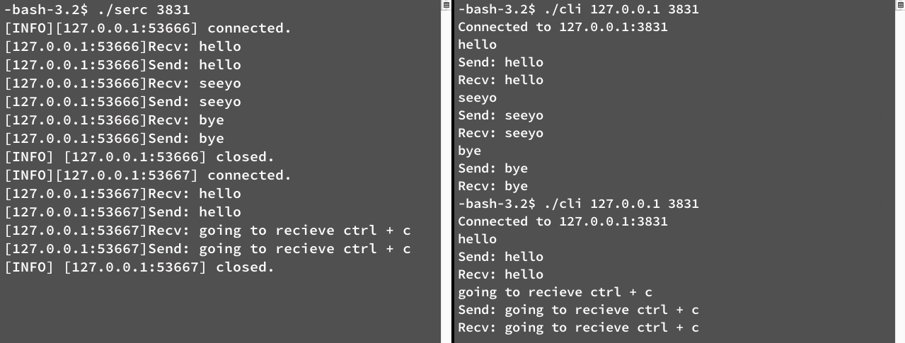
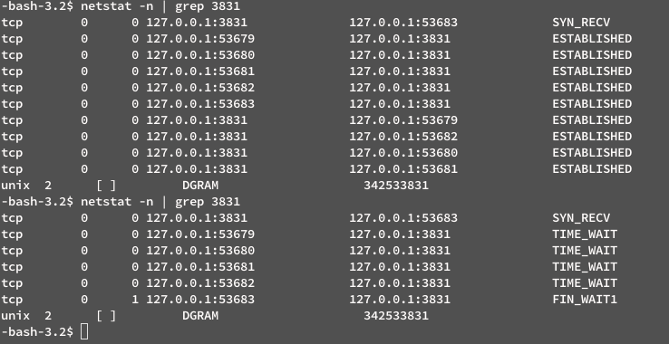
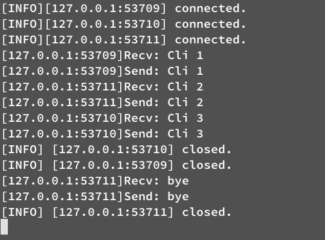

## 计算机网络课程实验报告

> 实验 3 - Socket 通信程序设计
>
> 实验时间: 3rd Nov, 2016


#### 1) 实验内容与目的

本次实验将在 Linux 环境下使用 Socket 编写简单的通信程序，模拟 echo 服务的运行，从而进一步熟悉运输层协议，掌握 TCP 协议主要特点、工作原理与 TCP 连接的建立与释放，理解 Socket 套接字的基本概念与原理，实现基于 Socket 的简单网络通信。

#### 2) 实验要求与实现

##### 实验 1. 实现迭代式 echo 服务

---

###### 1.1) echo 客户机

**实现要求：**

根据客户机范例代码 `echo_client_example.c`，完成以下修改：

1. 为所有 socket 函数调用添加异常处理；
2. 允许用户以参数形式从命令行输入服务器地址和端口；
3. 允许用户输入文本，按回车发送，获取服务器响应并显示；
4. 循环 ”接受用户输入—>按回车键发送—>获取并显示服务器响应“ 的流程，直到用户输入 `bye` 时退出循环并关闭连接；
5. 确保 `send()` 和 `recv()` 部分数据完整性。

**实现要点：** 

1. 根据 socket 函数返回值做出对应处理并关闭打开的描述符。其中异常处理函数可使用全局错误参数 `extern int errno` 实现，具体见源代码 [myerror.c](myerror.c) 。
2. 使用 `int argc, char *argv[]` 传递参数，并作相应判断即可。
3. 使用 `fgets()` 获取用户输入。
4. 使用 `while()` ，反复执行 " 获取输入-> 发送消息 -> 接收消息 -> 判断消息是否为 'bye\\n'，若不是则进入下一循环，否则断开连接并退出 " 的事件循环。
5. 在 `fgets()` 处对用户输入进行处理，保证超出预设缓存的部分也能被  `fgets()` 正确读入并发送到服务器。注意： Shell 本身也存在长度有限的输入缓冲区。

**注意事项：**

1. 对于用户输入端口号的检查：期望用户输入 0 - 65535 间的合法端口号，故程序应该拒绝在此范围外的端口号。同时，0 号端口为保留端口号，也不应该被使用。对于这两种情况，程序给出 ERROR 并退出。此外，当用户输入了 1 - 1023 间的熟知端口号时，如果程序不是在 sudo 权限下运行系统将拒绝绑定该端口，因此程序应该给出 WARN 警告信息。详见 myerror.c 与源程序的具体实现。
2. 为保证输入完整性，`fgets()` 应该从标准输入读入 `_BUFFER_SIZE_ - 1` 字节的字符，其中 `_BUFFER_SIZE_` 为程序预留的缓冲区大小，并做如下处理：若读入的最后一个字符不是换行符，则增添一个换行符；若读入的字符串长度为 0 或读入失败或只有一个换行符（一般为标准输入中未被消耗的回车），则忽略这次输入。通过这样的处理，服务器在正常情况下不会接收到空串或多余的换行符，同时超过 `_BUFFER_SIZE_` 长度的输入可以被按序多次发送并保持完整性。注意程序仍然受到 Shell 本身的输入缓冲区的限制。
3. 实验中发现，当客户机收到 `KILL`  信号量非正常退出时，服务器会一直收到空串。通过 2 中的处理，客户机正常情况下不会向服务器发送空串，故服务器收到空串时，可以判断客户机已离线，从而断开这个连接。

###### 1.2) 迭代式 echo 服务器

**实现要求：**

根据迭代式服务器范例代码 `echo_server_example.c`，完成以下修改：

1. 为所有 socket 函数调用添加异常处理；
2. 允许用户以参数形式从命令行输入服务器端口；
3. 循环处理客户机发来的消息，直到收到 "bye\n" 时结束循环；
4. 迭代处理客户机，直到输入 `Ctrl + C` 关闭服务器进程；
5. 确保 `send()` 和 `recv()` 部分数据完整性。

**实现要点：**

除了在 1.1 部分客户机的实现中提到的有关事项外， 迭代式服务器的实现还需注意以下要点：

1. 收到 "bye\n" 时应断开与客户机的数据 socket 连接；
2. 由于输入 `Ctrl + C` 时服务器进程被强制关闭，服务器程序较难实现正常退出（关闭打开的 listen socket），但这并不会带来严重后果——未正常关闭的网络套接字会被系统回收并延迟复用；
3. 服务器 `listen()` 函数的 `backlog` 参数决定了完成状态的最大长度，即已完成三次握手但尚未被服务器接受的客户机队列长度；
4. 服务器接收到空串时应关闭与客户机的数据 socket 连接——根据客户机中对输入的处理，服务器不会接受到用户发出的空串，因此接受到空串说明客户机已关闭。

**实验截图**

程序在 CentOS 5.11 下运行，编译器为 gcc 4.1.2.



> ***Fig. 1*** Iterating_echo_server and clients running at *localhost:3831*

+ **问题：设置服务器 `listen()`的 `backlog` 为 2，让 3 个客户机同时连接服务器，使用 `netstat` 命令观察服务器 `socket` 状态，对照 TCP 有限状态机图，说明这些状态的由来。**

  

  > ***Fig. 2*** Connecting multiple clients and having iterating_echo_server *backlog* set to 2

  + `backlog` 参数为 2 时，完成队列中最多允许 2 个客户机，故队列中的客户机均完成了 TCP 三次握手处于 ESTABLISHED 状态。对于多余的客户机，其发出连接请求后将处于 SYN_SENT 状态，一段时间后超时。

    客户机断开连接后，服务器将维持一段时间的 TIME_WAIT 状态，以免断开连接时服务器发送的 ACK 丢失并导致客户机重新发送 FIN 消息的情况，从而使用 TIME_WAIT 维护一段时间连接状态，直到超时断开。

    但在实际实验环境下发现 `backlog` 参数为 2 时完成队列中实际上允许 3 个客户机，这一问题尚待解释说明。

+ **问题：分析说明为什么客户机不建议 bind 固定端口。**

  + 客户机 bind 固定端口可能造成端口占用冲突。由于客户机断开连接后服务器将继续维持 TIME_WAIT 状态，或者服务器断开连接后客户机会进入 CLOSE_WAIT 状态，两者都会导致原有端口被占用。此外在使用固定端口的情况下，同一主机因为端口占用的问题只能开启一个客户机。

    因此，客户机端口交给系统分配空闲端口是较好的选择。

+ **问题：IP 地址和端口并没有作为数据传入 send()/recv() ，为什么也要进行字节顺序转换？不转换会有什么后果？**

  + 主机对于多字节的整型数据的表示为主机字节顺序（HBO），网络通信使用的表示为网络字节顺序（NBO），连接时需要传入 NBO 参数。若不进行转换，进行连接时 IP 地址将从 AAA.BBB.CCC.DDD 变为 DDD.CCC.BBB.AAA 造成错误发生。

**实验源代码**

>**Source Code** echo_client.c - echo 客户机

```C
#include <stdio.h>
#include <string.h>
#include <sys/types.h>
#include <sys/socket.h>
#include <netinet/in.h>
#include <arpa/inet.h>
#include <unistd.h>
#include "myerror.c"

#define _BUFFER_SIZE_ 255

int main(int argc, char *argv[])
{
	int client_sock, ser_port;
	struct sockaddr_in server_addr;
	char send_msg[_BUFFER_SIZE_];
	char recv_msg[_BUFFER_SIZE_];

	/* Check for argument(s) */
	if (argc != 3) {
		printf("usage: client SERVER_IP SERVER_PORT\n");
		exit(1);
	} else {
		ser_port = atoi(argv[2]);
		if (ser_port < 1024 && ser_port > 0) {
			printf("[WARN]using a well-known port %d\n", ser_port);
		} else if (ser_port <= 0) {
			printf("[ERROR]port error\n");
			exit(1);
		}
	}

	/* Create socket */
	if ((client_sock = socket(AF_INET, SOCK_STREAM, 0)) < 0) {
		err_fnc("socket");
	}

	/* Specify Server Addr */
	server_addr.sin_family = AF_INET;
	server_addr.sin_port = htons(ser_port);
	if (inet_aton(argv[1], &server_addr.sin_addr) == 0) {
		err_fnc("inet_aton");
	}
	memset(&server_addr.sin_zero, 0, sizeof(server_addr.sin_zero));

	/* Connect to server */
	if (connect(client_sock, (struct sockaddr *)&server_addr, sizeof(server_addr)) < 0) {
		err_fnc("connect");
	} else {
		printf("Connected to %s:%d\n", argv[1], ser_port);
	}

	while (1) {
		/* Send msg */
		memset(send_msg, 0, sizeof(send_msg)); // Clean up char *send_msg
		if (fgets(send_msg, _BUFFER_SIZE_, stdin) == NULL) {
			continue;
		}
		if (strlen(send_msg) == 0) { // Skip empty msg
			continue; 		
		} else if (send_msg[0] == '\n' && send_msg[1] == '\0') { 
			continue;
		}
		else {
			if (send_msg[strlen(send_msg) - 1] != '\n') { // Add \n to the end
				send_msg[strlen(send_msg)] = '\n';
			}
		}
		
		if (send(client_sock, send_msg, strlen(send_msg), 0) < 0) {
			err_wrn("send");
		} else {
			printf("Send: %s", send_msg);
		}

		/* Receive msg */
		memset(recv_msg, 0, sizeof(recv_msg));
		if (recv(client_sock, recv_msg, strlen(send_msg), 0) < 0) {
			err_wrn("recv");
		} else {
			printf("Recv: %s", recv_msg);
		}

		/* Close socket on "bye" */
		if (strcmp("bye\n", send_msg) == 0) {
			if (close(client_sock) < 0) {
				err_fnc("close");
			}
			break;
		}
	}
	return 0;
}

```

> **Source Code** echo_server_iteration.c - 迭代式 echo 服务器

```C
#include <stdio.h>
#include <stdlib.h>
#include <string.h>
#include <sys/types.h>
#include <sys/socket.h>
#include <netinet/in.h>
#include <arpa/inet.h>
#include <unistd.h>
#include "myerror.c"

#define _BUFFER_SIZE_ 255
#define _MAX_CLIENTS_QUEUE_ 2

int
main(int argc, char *argv[]) {

	int server_sock_listen, server_sock_data = -1, spec_port;
	socklen_t client_len;
	struct sockaddr_in server_addr, client_addr;
	char recv_msg[_BUFFER_SIZE_];
	bool new_conn_flag = false;

	/* Check for argument(s) */
	if (argc != 2) {
		printf("usage: server PORT\n");
		exit(1);
	} else {
		spec_port = atoi(argv[1]);
		if (spec_port < 1024 && spec_port > 0) {
			printf("[WARN]using a well-known port %d\n", spec_port);
		} else if (spec_port <= 0 || spec_port > 65535) {
			printf("[ERROR]port error\n");
			exit(1);
		}
	}

	/* Create socket */
	if ((server_sock_listen = socket(AF_INET, SOCK_STREAM, 0)) < 0) {
		err_fnc("socket");
	}

	/* Specify server config */
	server_addr.sin_family = AF_INET;
	server_addr.sin_port = htons(spec_port);
	server_addr.sin_addr.s_addr = htonl(INADDR_ANY);
	memset(&server_addr.sin_zero, 0, sizeof(server_addr.sin_zero));

	/* Bind IP and port */
	if ((bind(server_sock_listen, (struct sockaddr *)&server_addr, sizeof(server_addr))) < 0) {
		close(server_sock_listen);
		err_fnc("bind");
	}

	/* Listening socket */
	if (listen(server_sock_listen, _MAX_CLIENTS_QUEUE_) < 0) {
		close(server_sock_listen);
		err_fnc("listen");
	}

	/* Server loop */
	while (1) {
		/* Accept connection */
		while(server_sock_data < 0) {
			server_sock_data = accept(server_sock_listen, (struct sockaddr *)&client_addr, &client_len);
			new_conn_flag = true;
		}

		if (new_conn_flag) {
			printf("[INFO][%s:%d] connected.\n", inet_ntoa(client_addr.sin_addr), htons(client_addr.sin_port));
			new_conn_flag = false;
		}
		/* Receive msg */
		memset(recv_msg, 0, sizeof(recv_msg));
		if (recv(server_sock_data, recv_msg, sizeof(recv_msg), 0) < 0) {
			err_wrn("recv");
		} else {
			if(recv_msg[0] != '\0') {
				printf("Recv: %s", recv_msg);
			}
		}

		/* Send msg */
		if (send(server_sock_data, recv_msg, strlen(recv_msg), 0) < 0) {
			err_wrn("send");
		} else {
			if(recv_msg[0] != '\0') {
				printf("Send: %s", recv_msg);
			}
		}

		/* Close data socket on "bye" and wait for next */
		if (strcmp("bye\n", recv_msg) == 0 || recv_msg[0] == '\0') {
			if (close(server_sock_data) < 0) {
				close(server_sock_listen);
				err_fnc("close");
			} else {
				server_sock_data = -1;
				printf("[INFO]Closed and wait for next client.\n");
			}
		}
	}

	/* Close listening socket */
	if (close(server_sock_listen) < 0) {
		err_fnc("close");
	}

	return 0;
}

```

> **Source Code** myerror.c - 异常处理函数

```C
#ifndef _MY_ERROR_
#define _MY_ERROR_

#include <stdio.h>
#include <stdlib.h>
#include <string.h>

extern int errno;

void
err_fnc(const char *func) { /* Socket function error, exit */
	char *mesg = strerror(errno);
   	printf("[ERROR]%s(): %s\n", func, mesg);
   	exit(1);
}

void
err_wrn(const char *func) { /* Give warning */
	char *mesg = strerror(errno);
   	printf("[WARN]%s(): %s\n", func, mesg);
}

#endif 

```

##### 实验 2. 实现并发式 echo 服务器

---

**实验要求：**

在实验 1 的基础上修改服务器代码，以创建子进程的并发方式提供服务。

**实现要点：** 

1. 在父进程中使用 `fork()` 函数创建子进程负责在 `accept()` 后处理数据 socket;
2. 在子进程中处理消息循环，直到接收到 "bye\n" 后关闭数据 socket;
3. 使用  `fork()` 函数返回值判断目前程序处于父进程中或是子进程中。

**注意事项：**

1.  `fork()` 函数产生的子进程与父进程共享代码段，同时采用 COW 机制复制父进程的内存栈等；
2. 使用 `signal(SIGCHLD,SIG_IGN)`  忽略子进程返回的信号并将其移交 init 进程，或者使用 `wait()` 函数接受子进程信号，以免产生僵尸进程。

**实验截图**



> ***Fig. 3*** Concurrent_echo_server running with 3 client connections

+ **问题：服务器 `accept()`之后会返回一个用于传输数据的 socket，调用 `fork()` 会使父子进程同时拥有此 socket 描述符，父进程分支中是否需要关闭该 socket？请分析原因。**
  + 不需要。`fork()` 函数创建子进程时会复制父进程的内存段，故两个进程中的数据 socket 都指向同一个套接字，只需让子进程负责关闭数据 socket，父进程管理 listen socket 即可。

#### 3) 实验中尚存的问题

从上面的 Fig.2 可见， `backlog` 参数为 2 时，完成队列中实际上允许了 3 个客户机。

此外，在 macOS 10.12.2 环境下，出现了第一个连接服务器的客户机地址均被显示为 2.0.0.0:0 的情况，而 `backlog` 参数则未出现 CentOS 5.11 中的问题。

排查程序未能发现这些现象出现的原因，但是由此可见 socket 函数在不同 Linux 版本中的实现均存在一定差异，需要进一步深入探究。

---

