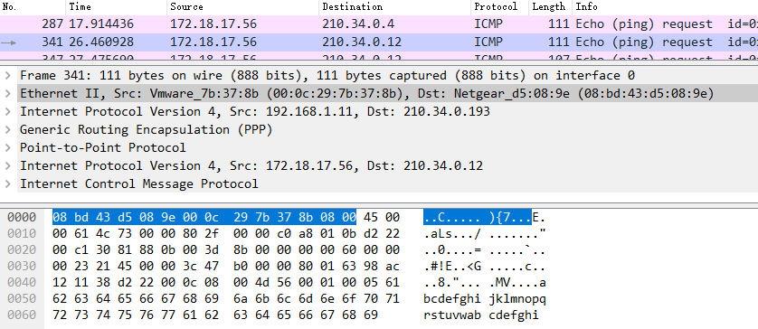
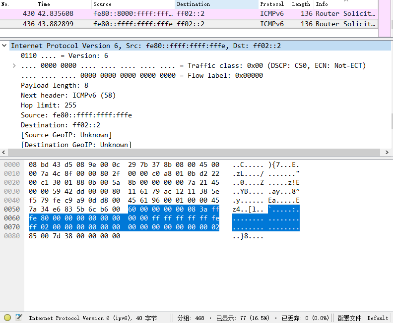

## 计算机网络课程实验报告

> 实验 4 - 路由实验
>
> 实验时间: 17th Nov, 2016
>

#### 1) 实验内容与目的

本次实验中我们将主机连接到厦门大学 VPN 获取 IPv6 地址，并在 IPv6 环境下完成简单的抓包分析。之后我们将进行编程模拟路由器使用 Distance-Vector 算法建立路由表的过程，并讨论 DV 协议的局限性与相应的解决方法，进一步加深对路由与网络拓扑结构的理解。

#### 2) 实验要求与实现

##### 实验 1. IPv6 环境下使用 Wireshark 抓包

---

###### 1.1) ICMP 报文抓取

**实现要求：**

连接厦大 VPN 后，使用 Wireshark 抓取一个 ICMP 报文，截图分析其从上到下的封装过程。实验中抓取到的 ICMP 报文如 ***Fig. 1*** 所示。

**实验截图**



> ***Fig. 1*** Captured ICMP packet with VPN connection

**封装分析：**

连接到 VPN 网络后，ICMP 报文具有以下封装：

`以太帧信息 -> IPv4 数据报首部 -> GRE 数据报 -> PPP 数据报 -> (IPv4 数据报首部 -> ICMP 报文) ` ，为 GRE 协议报文，括号内为交给 GRE 协议处理以发送给 VPN 服务器的用户数据报。

其封装过程如下：ICMP 数据报首先被加上 IPv4 首部构成原始用户数据报，这里源 IP 地址为 VPN 网络下发的地址，目的 IP 地址为请求的目标地址；

之后原始用户数据报**通过 GRE 隧道封装**，加上了供 VPN 服务器使用的 GRE 协议信息与新的 IPv4 首部，这里源 IP 地址为用户所在网络地址，目的地址为 VPN 服务器地址，**原来的用户数据报构成了新的 IP 报文的数据部分**。

之后这个新的报文被加上以太帧信息发送到数据链路层，路由器根据第一个 IPv4 首部将报文发送至 VPN 服务器，服务器获取到这个报文后抽取出原始用户数据报上交至应用层的 VPN 服务程序，VPN 服务程序再将原始用户数据报直接交付数据链路层进行传输，此时的封装结构为：

`以太帧信息 -> IPv4 数据报首部 -> ICMP 报文 ` ，为一般的 ICMP 报文。

######  1.2) IPv6 数据报抓取

**实现要求：**

获取 VPN 分配的 IPv6 地址后，使用 Wireshark 抓取一个 IPv6 数据报，截图分析其 IP 首部的各字段格式定义。

**实验截图**



> ***Fig. 2*** Captured IPv6 packet header with VPN connection

**IPv6 报文首部信息：**

1. Version

   IP 协议版本信息，占 4 位

2. Traffic class

   通信量类，占 8 位，区分不同的 IPv6 数据报类别或优先级。

3. Flow label

   流标号，占 20 位，为 IPv6 中“流”的概念提供资源预分配等支持。

4. Payload length

   有效荷载长度，占 16 位，指明 IPv6 数据报中除基本首部外的字节数，最大值为 64KB。

5. Next header

   下一个首部，占 8 位，相当于 IPv4 的协议字段或可选字段。

6. Hop limit

   跳数限制，占 8 位，允许该数据报在网络中经过的最大跳数，相当于 TTL 字段。

7. Source

   IPv6 格式的源地址，占 128 位。

8. Destination

   IPv6 格式的目的地址，占 128 位。

IPv6 数据报基本首部长度固定为 40 B，之后为其扩展首部及数据部分（有效荷载部分）。


##### 实验 2. 路由器 DV 算法模拟

---

###### 2.1)  模拟路由收敛

已知的网络拓扑如课件所示，使用 DV 算法模拟该网络的迭代收敛过程。

**程序实现：**

程序使用 C++ 语言编写，系统环境为 macOS 10.12.2 ，使用的编译器为 LLVM version 8.0.0 .

程序接受类似于 `AE8` 的字段来构造从路由 A 至路由 E 之间长度为 8 的通路。对于同一组路由的输入，后面的输入会覆盖前面已经建立的通路，不区分大小写，输入 `0` 时结束路由表的初始化。对于课件中给出的网络拓扑，合法的输入之一为：

```Input
ab7
ae1
be8
bc1
cd2
de2
0
```

对于路由表信息，采用如下的结构体进行储存：

```c++
typedef struct nod_info {
    char    next;	//下一跳目的路由
    int     real;	//相连的路由器间的直接距离
    int     dist;	//拓扑最短距离
    bool    isAdj;	//是否为相邻路由
} rtnode;
```

采用 DV 算法来模拟路由器收敛，方法为同步更新。

**实验输出**

根据输入信息构造的路由表：

```Output
Initial table:
       Router A
Desc    Next    Dist
 A       A       0
 B       B       7
 C       C       -
 D       D       -
 E       E       1

       Router B
Desc    Next    Dist
 A       A       7
 B       B       0
 C       C       1
 D       D       -
 E       E       8

       Router C
Desc    Next    Dist
 A       A       -
 B       B       1
 C       C       0
 D       D       2
 E       E       -

       Router D
Desc    Next    Dist
 A       A       -
 B       B       -
 C       C       2
 D       D       0
 E       E       2

       Router E
Desc    Next    Dist
 A       A       1
 B       B       8
 C       C       -
 D       D       2
 E       E       0
```

第一次迭代结果：

```Output
Running Distance-Vector Updating:
Run 1:

       Router A
Desc    Next    Dist
 A       A       0
 B       B       7
 C       B       8
 D       E       3
 E       E       1

       Router B
Desc    Next    Dist
 A       A       7
 B       B       0
 C       C       1
 D       C       3
 E       E       8

       Router C
Desc    Next    Dist
 A       B       8
 B       B       1
 C       C       0
 D       D       2
 E       D       4

       Router D
Desc    Next    Dist
 A       E       3
 B       C       3
 C       C       2
 D       D       0
 E       E       2

       Router E
Desc    Next    Dist
 A       A       1
 B       D       5
 C       D       4
 D       D       2
 E       E       0
```

第二次迭代结果：

```Output
Run 2:
       Router A
Desc    Next    Dist
 A       A       0
 B       E       6
 C       E       5
 D       E       3
 E       E       1

       Router B
Desc    Next    Dist
 A       A       7
 B       B       0
 C       C       1
 D       C       3
 E       C       5

       Router C
Desc    Next    Dist
 A       D       5
 B       B       1
 C       C       0
 D       D       2
 E       D       4

       Router D
Desc    Next    Dist
 A       E       3
 B       C       3
 C       C       2
 D       D       0
 E       E       2

       Router E
Desc    Next    Dist
 A       A       1
 B       D       5
 C       D       4
 D       D       2
 E       E       0
```

第三次迭代结果：

```Output
Run 3:
       Router A
Desc    Next    Dist
 A       A       0
 B       E       6
 C       E       5
 D       E       3
 E       E       1

       Router B
Desc    Next    Dist
 A       C       6
 B       B       0
 C       C       1
 D       C       3
 E       C       5

       Router C
Desc    Next    Dist
 A       D       5
 B       B       1
 C       C       0
 D       D       2
 E       D       4

       Router D
Desc    Next    Dist
 A       E       3
 B       C       3
 C       C       2
 D       D       0
 E       E       2

       Router E
Desc    Next    Dist
 A       A       1
 B       D       5
 C       D       4
 D       D       2
 E       E       0
```

收敛后的路由表：

```Output
Run 4:
       Router A
Desc    Next    Dist
 A       A       0
 B       E       6
 C       E       5
 D       E       3
 E       E       1

       Router B
Desc    Next    Dist
 A       C       6
 B       B       0
 C       C       1
 D       C       3
 E       C       5

       Router C
Desc    Next    Dist
 A       D       5
 B       B       1
 C       C       0
 D       D       2
 E       D       4

       Router D
Desc    Next    Dist
 A       E       3
 B       C       3
 C       C       2
 D       D       0
 E       E       2

       Router E
Desc    Next    Dist
 A       A       1
 B       D       5
 C       D       4
 D       D       2
 E       E       0
Run 5:DV Converged.
```

源代码实现见 [dv_router_1.cpp](dv_router_1.cpp).

###### 2.2)  模拟拓扑变化

在任务 2.1 的网络收敛后，将 A 与 B 之间的距离修改为 3，模拟该拓扑变化导致的重新收敛过程。

**程序实现：**

本程序在 2.1 的基础上通过 `void addConn(int, int, int, bool)` 函数修改路由 A 与 B 间的距离，并重新运行 `int dvUpdate()` 来模拟收敛过程。 

变化后第一次迭代：

```Output
Distance from A to B changed to 3. Rerun DV:

       Router A
Desc    Next    Dist
 A       A       0
 B       B       3
 C       B       4
 D       E       3
 E       E       1

       Router B
Desc    Next    Dist
 A       A       3
 B       B       0
 C       C       1
 D       C       3
 E       A       4

       Router C
Desc    Next    Dist
 A       B       4
 B       B       1
 C       C       0
 D       D       2
 E       D       4

       Router D
Desc    Next    Dist
 A       E       3
 B       C       3
 C       C       2
 D       D       0
 E       E       2

       Router E
Desc    Next    Dist
 A       A       1
 B       A       4
 C       D       4
 D       D       2
 E       E       0
```

收敛后的路由表：

```Output
Run 2:
       Router A
Desc    Next    Dist
 A       A       0
 B       B       3
 C       B       4
 D       E       3
 E       E       1

       Router B
Desc    Next    Dist
 A       A       3
 B       B       0
 C       C       1
 D       C       3
 E       A       4

       Router C
Desc    Next    Dist
 A       B       4
 B       B       1
 C       C       0
 D       D       2
 E       D       4

       Router D
Desc    Next    Dist
 A       E       3
 B       C       3
 C       C       2
 D       D       0
 E       E       2

       Router E
Desc    Next    Dist
 A       A       1
 B       A       4
 C       D       4
 D       D       2
 E       E       0
Run 3:DV Converged.
```

源代码实现见 [dv_router_2.cpp](dv_router_2.cpp).

###### 2.3)  制造路由回路

在任务 2.1 的网络收敛后，将 B 与 C 断开，模拟该拓扑变化导致的重新收敛过程。

**程序实现：**

本程序在 2.1 的基础上通过增加 `void delConn(int, int)` 函数断开路由 B 与 C 间的连接，并重新运行 `int dvUpdate()` 来模拟收敛过程。 

**该实验中未能形成路由回路，且生成了错误的路由表。**

源代码实现见 [dv_router_3.cpp](dv_router_3.cpp).

###### 2.4)  抑制路由回路

在任务 2.3 的基础上加入逆向毒化技术，模拟 B 与 C 断开所导致的重新收敛过程。

**程序实现：**

本程序在 2.3 的基础上增加逆向毒化（ Reverse-Poison ）过程重新模拟收敛过程。 

**上一实验中未能形成路由回路，且生成了错误的路由表。**

源代码实现见 [dv_router_4.cpp](dv_router_4.cpp).

+ **问题：请举例说明为什么逆向毒化不能阻止回路生成。**（参考 [RFC1058](https://www.ietf.org/rfc/rfc1058.txt).）
  + 答：逆向毒化技术通过将路由器发送给相邻路由器的路由表中来源于相邻路由器的路由项设置为不可达，避免了发生路由器断开后，延迟的信息反而修改了正确的、路由已断开的信息，从而降低了回路生成几率。

  + 但是考虑下面的拓扑结构：

    ```Input
          B-------C
           \     /
            \   /
              A
              |
              D
    ```

    当 A 与 D 断开连接时，可能造成：

    B 收到 A 的消息后，选择从 C 到达 D；

    B 向 A 发送更新报文；

    A 向 C 发送更新报文。

    在这种结构里面，由于 B 与 C 无法同时接受到 A 的更新报文，仍然会有回路生成的可能，因而逆向毒化无法阻止回路形成。

#### 3) 实验中尚存的问题

在本次实验的 2.3 中，实际并没有回路生成，路由信息最后总能达到收敛状态。这是因为 2.3 中断开的 B 与 C 处在一个环内，路由回路的形成需要拓扑结构出现不可达的路由区域，这一点在  [RFC1058](https://www.ietf.org/rfc/rfc1058.txt) 中有所声明。

回顾本次实验中的程序有关数据结构的设计，不难发现有以下几个问题：

（1）DV 算法中采用了直接遍历路由表的做法。然而在实际的路由表更新中，采用的方法是在有路由器信息更新时由路由器向相邻路由器主动地发送报文，这可能是后面两个实验中错误路由表出现的原因：正确的消息被错误、延宕的消息覆盖——但在实际情况中不应该由没有发生更新的路由器发送报文。

（2）在需要进行逆向毒化的时候侵入地修改了路由表内容。对于路由表更新的行为，应该考虑路由器 "收到"相邻路由器的路由表信息，而不应该直接修改原路由表。

总的说来，本次实验较为失败，没能在时限内找到正确的编程思路是主要原因之一，应该下来后仔细从头思考如何 "模拟" DV 算法的行为，审慎设计有关流程与数据结构后再重新构建正确的程序。

---

